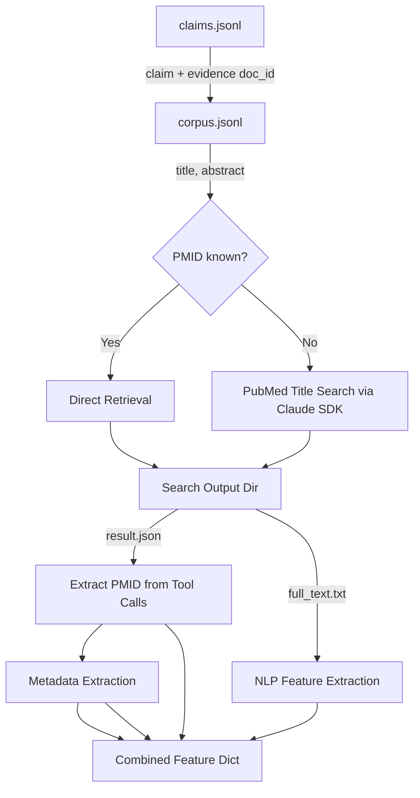

# PKEvolve: Knowledge Graph Curation

PKEvolve is an AI tool for correcting Gene Regulatory Networks (GRNs) using Large Language Models (LLMs)

## Installation

```bash
# Using uv (Recommended)
uv sync
```

## Repository Structure

The `scripts/` directory is organized into the following pipelines:

*   **`scripts/qa_pipeline/`**: Main inference scripts for running LLM-based Question Answering and validation.
    *   `run_qa.py`: Main entry point for QA tasks (`nosearch`, `search`, etc.).
*   **`scripts/analysis/`**: Tools for analyzing experimental results and calculating metrics (F1, Accuracy, etc.).
    *   `analyze_qa_results.py`: Standard analysis for QA runs.
*   **`scripts/context_labeling/`**: Dataset generation pipeline for Model Distillation.
    *   `sufficient_context.py`: Logic for labelling "Sufficient Context".
    *   `fetch_signor_paper_details.py`: Data fetching utilities.
*   **`scripts/claude_sdk/`**: Specialized scripts utilizing the official Anthropic/Claude SDK for high-fidelity tasks involving skills and plugins.

## Feature Extraction Data Flow



### Feature Engineering Details

#### Semantic Similarity (SBERT)
We use a **Sentence-BERT (SBERT)** model (default: `all-MiniLM-L6-v2`) to compute the cosine similarity between the Claim and the Evidence text.

**Chunking Strategy for Long Documents:**
Since SBERT models typically have a token limit (e.g., 512 tokens), full-text evidence is handled via **Max-Pooling over Chunks**:
1. The evidence text is split into overlapping chunks (default: 256 tokens, 64 token overlap).
2. Each chunk is encoded and compared to the claim.
3. The **maximum** similarity score across all chunks is used as the final feature. This ensures that if *any* part of the paper strongly supports/refutes the claim, the signal is captured.

## Usage

Run scripts using `uv run python`:

```bash
# Run the main QA pipeline
uv run python scripts/qa_pipeline/run_qa.py --help

# Run analysis on results
uv run python scripts/analysis/analyze_qa_results.py --help
```
