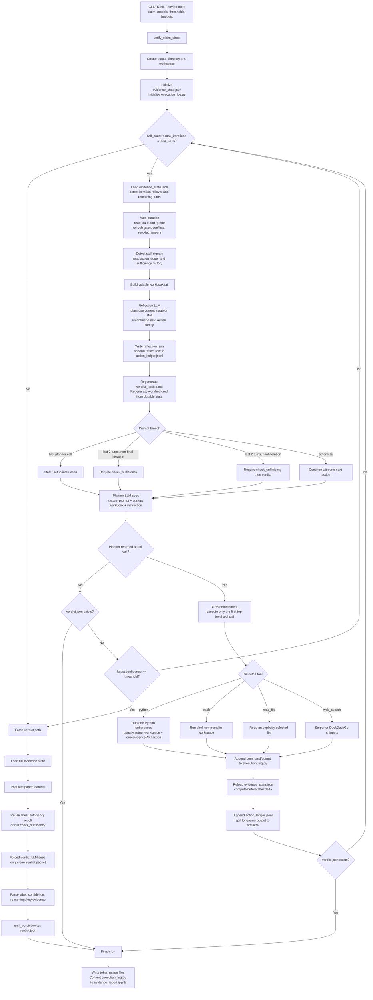
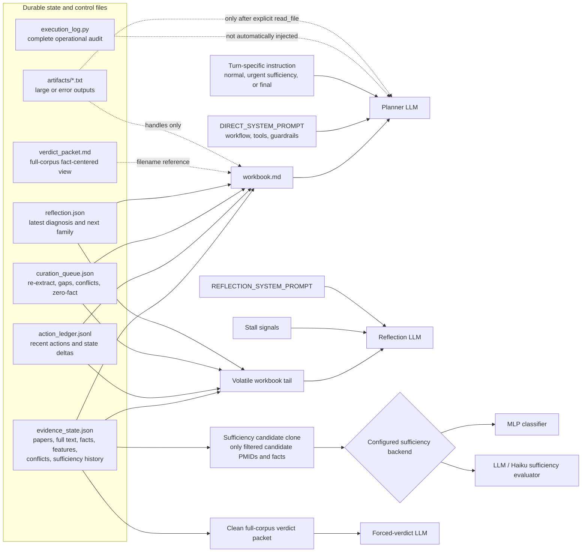
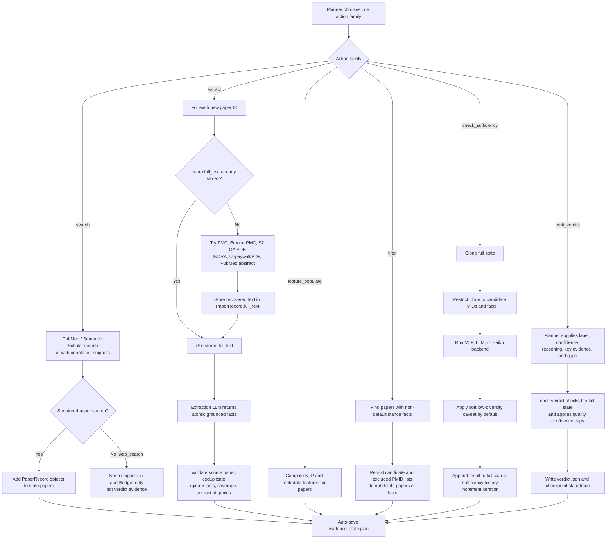
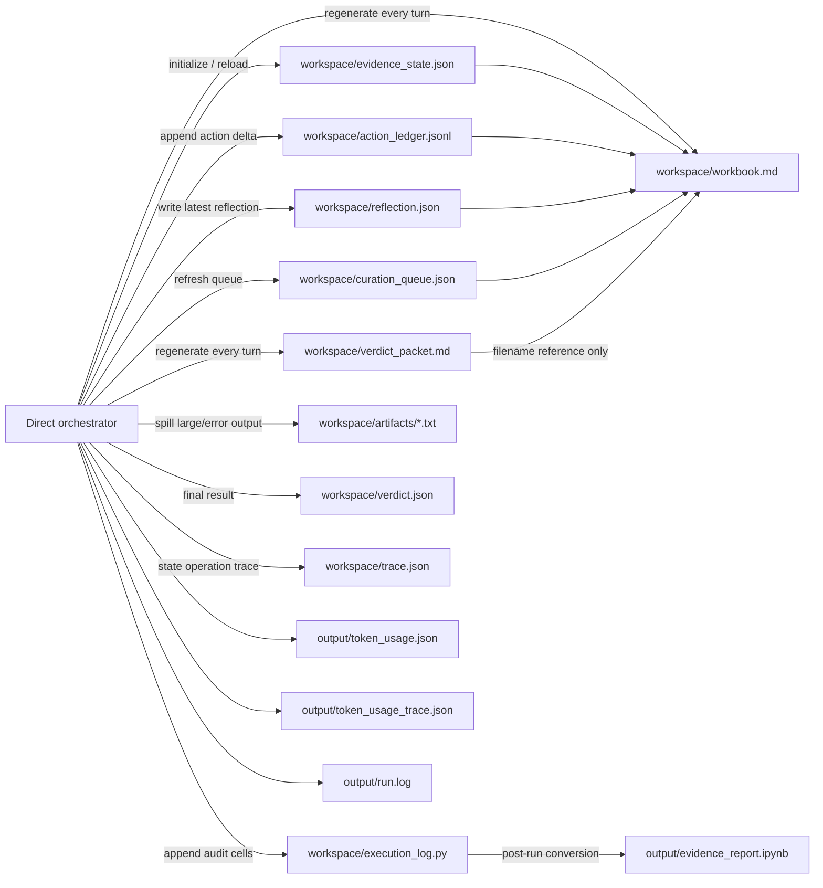

# Current ProClaim Flow

This document describes the current `direct` mode implemented by
`evidence_programming_direct.py`. It distinguishes:

- what the orchestrator reads;
- what each LLM or classifier actually sees;
- which files are written;
- where decisions are made.

## 1. End-to-End Control Flow

## 2. What Each Decision Maker Sees

### Actual visibility

| Component | Sees | Does not automatically see | Decision |
| --- | --- | --- | --- |
| Planner LLM | `DIRECT_SYSTEM_PROMPT`, full current `workbook.md`, turn instruction | previous chat turns, raw `execution_log.py`, full artifacts, raw `action_ledger.jsonl`, raw `evidence_state.json` | Selects the next concrete action and arguments |
| Reflection LLM | stall signals and the volatile workbook tail | raw paper text, raw execution log, full stable workbook prefix | Classifies retrieval/extraction/framing/budget state and recommends an action family |
| Extraction subagent | claim, subclaims, latest extraction context, one paper's full text or abstract | workbook control text and action history | Extracts grounded facts and stance labels |
| Sufficiency backend | a cloned candidate-only state after stance filtering | excluded papers and facts in the full corpus | Produces sufficient/insufficient, confidence, and gaps |
| Forced-verdict LLM | clean full-corpus verdict packet | action history, reflection diagnosis, guardrails, recuration queue | Chooses final verdict, confidence, reasoning, and key evidence |

The current implementation builds the reflection input with
`build_workbook_parts()`. Its volatile tail includes Sections 3, 4, 4a, 5, 6,
7, 8, and 9, so the reflection LLM can also see the previous turn's Section 9
guidance.

## 3. Evidence Action Flow

## 4. Workspace File Map

### File purpose

| File | Read by current loop | Written by current loop | Role |
| --- | --- | --- | --- |
| `evidence_state.json` | orchestrator, workbook, curation, tools, sufficiency | evidence API mutations | Source of truth for papers, facts, features, filtering, and sufficiency |
| `workbook.md` | planner; indirectly reflection through an in-memory rebuild | workbook renderer every turn | Compact planning context |
| `action_ledger.jsonl` | workbook, stall detector | orchestrator after reflection/tool actions | Anti-repetition memory and state deltas |
| `reflection.json` | workbook; next reflection input through Section 9 | reflection LLM path | Latest diagnosis and recommended action family |
| `curation_queue.json` | workbook, auto-curation | curation helpers | Explicit retry/gap/contradiction queue |
| `verdict_packet.md` | explicit file read only; workbook references its filename, while forced verdict rebuilds the same packet in memory | workbook renderer | Clean fact-centered final reasoning view |
| `execution_log.py` | notebook generator; explicit `read_file` only if requested | every dispatched tool action and planner narration | Full audit, not primary planner context |
| `artifacts/*.txt` | only after explicit file read | action ledger spill logic | Raw large/error outputs |
| `verdict.json` | stop checks and final display | `emit_verdict` | Terminal result |
| `trace.json` | audit/debugging | state checkpoints and traced operations | Detailed state-operation audit |

## 5. Decision Points

1. **Iteration rollover:** reset the per-iteration turn counter after
   `check_sufficiency` increments `state.iteration`.
2. **Auto-curation:** derive queue items from latest gaps, conflicts, and
   extracted papers that produced zero facts.
3. **Reflection:** choose the recommended family:
   `search`, `extract`, `re_extract`, `feature_populate`, `filter`,
   `check_sufficiency`, `emit_verdict`, `curate`, or `none`.
4. **Turn urgency:** with two turns left, close a non-final iteration with
   sufficiency; in the final iteration, stop retrieval and move to verdict.
5. **Planner action:** choose one concrete top-level tool call. GR6 drops every
   additional top-level call.
6. **Search result handling:** PubMed/S2 results become papers; generic web
   snippets remain orientation/audit text and are not inserted as facts.
7. **Extraction cache:** skip PMIDs in `extracted_pmids`; a new terminology
   context note clears the cache and queues re-extraction.
8. **Stance filter:** retain the full corpus but select only papers with
   non-default stance facts for sufficiency.
9. **Sufficiency:** evaluate the candidate-only clone, then copy only
   sufficiency bookkeeping back to the full state.
10. **Verdict readiness:** recommend `emit_verdict` on threshold, a soft
    low-diversity-only caveat, stagnation with directional facts, or
    final-budget pressure. The loop itself terminates only after a verdict, or
    exits to the forced-verdict path.
11. **Forced verdict:** if no `verdict.json` exists when the loop exits, run the
    clean packet-based verdict path.

## 6. Source Files Inspected

- `src/proclaim/verification/evidence_programming_direct.py`
- `src/proclaim/verification/workbook.py`
- `src/proclaim/verification/action_ledger.py`
- `src/proclaim/verification/reflection.py`
- `src/proclaim/verification/curation.py`
- `src/proclaim/verification/evidence_state.py`
- `src/proclaim/verification/evidence_api.py`
- `src/proclaim/verification/verdict_packet.py`
- `src/proclaim/verification/prompts.py`
- `src/proclaim/verification/full_text.py`
- `src/proclaim/verification/config.py`
