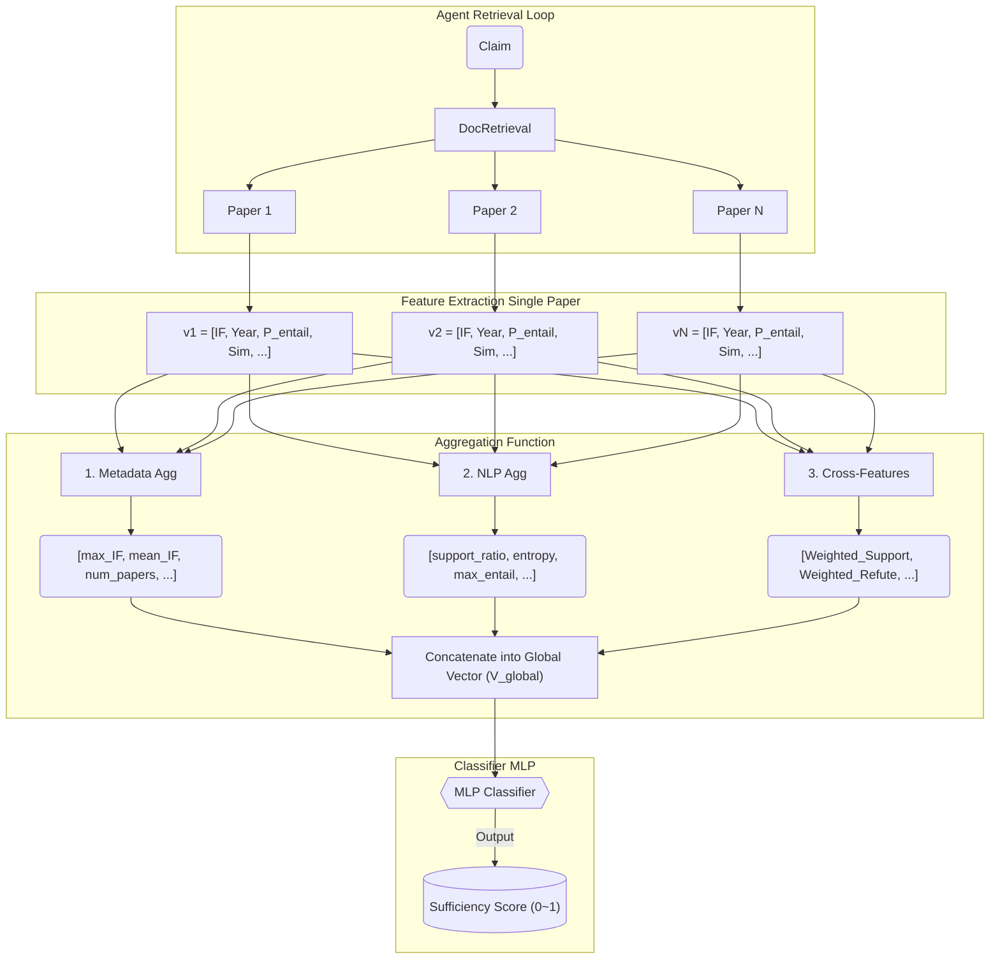

# Scientific Claim Verification: Feature Engineering & Aggregation

This document defines the technical specifications for extracting features from individual papers (Local Features) and aggregating them across multiple papers (Global Aggregation). 
The objective is to train a **Routing/Stopping Criterion Classifier**. This classifier predicts a **Sufficiency Score (0 ~ 1)** based on retrieved evidence, deciding whether the current evidence pool is sufficient to stop retrieval and hand over to the LLM for the final verdict.

---

## Section 1: Local Feature Extraction (Single Paper Level)

In this phase, for each retrieved Evidence Paper $P_i$ and Claim $C$, we extract a feature vector $v_i$. These features are categorized into three groups: Metadata, NLP Metrics, and LLM Reasoning.

### 1. Metadata Features (Source Reliability & Context)
These features quantify the credibility and timeliness of the evidence source, acting as a Bayesian prior for the verification model.

* **Publication Year (Done)**
* **Journal Impact Factor (IF) (Done)**
    * **Definition:** The impact metric of the venue (journal/conference). Recommended preprocessing: $\log(1 + \text{IF})$.
* **Normalized Citation Count (Done)**
    * **Definition:** The citation count of the paper, normalized by its age.
    * **Formula:** $\frac{\text{Citation Count}}{\text{Current Year} - \text{Pub Year} + 1}$.
* **Author H-index (Max) (Done)**
    * **Definition:** The highest H-index among the paper's authors.
* **Document Type (Paused)**
    * **Definition:** Categorical classification of the evidence level.
    * **Values:** `[Meta-analysis, RCT, Cohort Study, Case Report, Review, Opinion]`.
    * **Rationale:** Based on the Hierarchy of Evidence, a Meta-analysis or RCT carries significantly more weight than an Opinion piece or Case Report.
* **Section Source (Paused)**
    * **Definition:** The specific section of the paper from which the evidence sentence was extracted.
    * **Values:** `[Abstract, Introduction, Methods, Results, Discussion]`.
    * **Rationale:** Evidence from `Results` is direct experimental data, whereas `Introduction` may cite external work, and `Discussion` is interpretative.

### 2. NLP Features (Semantics & Alignment)
These features capture the linguistic alignment and logical entailment between the Claim and the Evidence text.

* **Semantic Similarity (Done)**
    * **Definition:** Cosine similarity between the embeddings (e.g., SBERT) of the Claim and the Evidence.
    * **Rationale:** Measures topical proximity and relevance in the vector space.
* **Claim Entity Coverage (Done)**
    * **Definition:** Recall of Named Entities in the Claim that also appear in the Evidence: $\frac{|\text{Claim Entities} \cap \text{Evidence Entities}|}{|\text{Claim Entities}|}$.
    * **Rationale:** Since claims are much shorter than evidence texts (e.g., full abstracts), Jaccard similarity is diluted by the many entities in the evidence. Recall focuses on whether the evidence covers the specific entities mentioned in the claim, providing a more meaningful alignment signal.
* **NLI (Natural Language Inference) Entailment Score**
    * **Definition:** Probabilities predicted by a fine-tuned Natural Language Inference model (e.g., DeBERTa-v3-large).
    * **Output:** Vector: $[P(\text{Entailment}), P(\text{Contradiction}), P(\text{Neutral})]$.
    * **Rationale:** The most direct semantic signal indicating whether the text supports or refutes the claim.

### 3. LLM-Native Features (Reasoning & Uncertainty)
Leveraging the zero-shot reasoning capabilities and intrinsic uncertainty metrics of Large Language Models. *(Currently all active LLM features are marked as Paused to ensure the classifier remains lightweight and independent of the LLM).*

* **LLM Verdict (Paused)**
    * **Definition:** The classification label predicted by the LLM after reading the evidence (One-hot encoded).
    * **Values:** `[Supported, Refuted, Not Enough Info]`.
* **Verdict Confidence (Logprobs) (Paused)**
    * **Definition:** The exponential of the log-probability of the generated verdict token.
    * **Formula:** $\exp(\text{LogProb}(\text{"Supported"}))$.
    * **Rationale:** Represents the model's intrinsic confidence (uncertainty) in its own judgment.
* **Context Sufficiency (Paused)**
    * **Definition:** A score (Binary or 0-1) assessing whether the retrieved text contains *enough information* to verify the claim.
    * **Rationale:** Filters out paragraphs that are topically relevant but lack the specific evidentiary value needed.
* **Perplexity (PPL) (Paused)**
    * **Definition:** The perplexity of generating the Claim conditioned on the Evidence: $P(\text{Claim} | \text{Evidence})$.
    * **Rationale:** If the Evidence supports the Claim, the Claim should follow naturally (low PPL). If they contradict, PPL is typically higher.

---

## Section 2: Feature Aggregation Methods (Multi-Paper Level)

Once we have collected Local Feature Vectors $\{v_1, v_2, ..., v_n\}$ for $N$ papers, we apply an Aggregation Layer to compress them into a single global vector ($V_{global}$) for the Classifier. The Classifier evaluates this vector to output a **Sufficiency Score (0 ~ 1)**.

### Pipeline Flowchart

### 1. Metadata Aggregation (Prior Credibility)
Metadata features are aggregated to represent the overall "quality", "authority", and "timeliness" of the current evidence pool.

* **Evidence Volume**
    * `num_papers`: Total number of retrieved papers ($N$). Very few papers might mean low sufficiency.
* **Authority & Quality**
    * `max_IF`: The highest Impact Factor in the pool (the "quality ceiling").
    * `mean_IF` / `median_IF`: The average publication quality.
    * `max_h_index`: Highest author H-index (presence of authoritative figures).
* **Community Attention**
    * `max_norm_citation`: Highest normalized citation count (presence of a seminal/breakthrough paper).
    * `mean_norm_citation`: Average attention the evidence pool has received.
* **Temporal Footprint**
    * `latest_year`: How recent the newest evidence is (e.g., `Current Year - Max Pub Year`).
    * `earliest_year`: How old the oldest evidence is.
    * `year_span`: `latest_year - earliest_year`. A larger span indicates a long-studied topic.

### 2. NLP Feature Aggregation (Semantic Signal & Consensus)
NLP features (like NLI entailment probabilities and Semantic Similarity) are aggregated to represent the consensus, semantic relevance, and controversy of the evidence.

* **Voting & Consensus (Stance Distribution)**
    * `support_ratio` ($p_{sup}$): Proportion of papers where `argmax(P) == Entailment`. (Using simple majority voting without a hard threshold).
    * `refute_ratio` ($p_{ref}$): Proportion of papers where `argmax(P) == Contradiction`.
    * `controversy_index` (Entropy): Shannon entropy of the stance distribution. 
        * **Formula:** $H = - (p_{sup} \log_2 p_{sup} + p_{ref} \log_2 p_{ref} + p_{neu} \log_2 p_{neu})$ (using $0 \log_2 0 = 0$)
        * **Rationale:** High entropy (e.g., $1.0$ for 50/50 support/refute split) indicates high disagreement in the scientific community (which in itself might be a "sufficient" conclusion for the LLM to summarize). Low entropy (e.g., $0.0$ for universal consensus) indicates a clear, unified stance.
* **Statistical Pooling (Signal Strength)**
    * `max_entailment`: $\max(P_{\text{entailment}})$ across all $N$ papers. The single strongest piece of supporting evidence.
    * `max_contradiction`: $\max(P_{\text{contradiction}})$ across all $N$ papers. The single strongest piece of refuting evidence.
    * `max_entity_coverage`: $\max(\text{Entity Coverage})$ across all $N$ papers. Shows if at least one paper touches almost all key entities of the claim.
    * `mean_entity_coverage`: Average recall of claim entities across the evidence pool.
    * `max_similarity`: $\max(\text{Semantic Similarity})$ across all $N$ papers. Indicates if at least one retrieved document is highly on-topic.
    * `mean_similarity`: Average semantic relevance to the claim.

### 3. Cross-Features (Signal $\times$ Quality Interaction)
**What is a Cross-Feature?** 
If we feed `max_IF = 40` and `support_ratio = 0.5` independently to the Classifier, it doesn't know if the `IF=40` paper voted "Support" or "Refute", or if it was "Neutral". A cross-feature explicitly multiplies a metadata weight with an NLP signal *before* aggregation.

Because our Target is **Sufficiency (Supported OR Refuted)**, we must compute these cross-features *symmetrically* for both the Entailment and Contradiction signals. If highly-weighted papers strongly refute a claim, the Classifier needs to see a high "Refute Score" to confidently output $y=1$.

* **Quality-Weighted Stance Score**
    * `Weighted_Support` = $\sum_{i=1}^{N} \log(1 + IF_i) \cdot P_{entailment, i}$
    * `Weighted_Refute` = $\sum_{i=1}^{N} \log(1 + IF_i) \cdot P_{contradiction, i}$
    * *Rationale:* Scales the stance probability of each paper by its Impact Factor. If `Weighted_Refute` is very high while `Weighted_Support` is low, the system is Sufficiently Refuted ($y=1$). If both are high, it's a High-Profile Conflict ($y=0$).
* **Attention-Weighted Stance Score**
    * `Weighted_Support` = $\sum_{i=1}^{N} \text{Norm\_Citation}_i \cdot P_{entailment, i}$
    * `Weighted_Refute` = $\sum_{i=1}^{N} \text{Norm\_Citation}_i \cdot P_{contradiction, i}$
    * *Rationale:* Heavily cited papers have a stronger influence on the aggregated stance.
* **Temporal-Decay Stance Score**
    * `Weighted_Support` = $\sum_{i=1}^{N} e^{-\lambda(\text{Current Year} - \text{Pub Year}_i)} \cdot P_{entailment, i}$
    * `Weighted_Refute` = $\sum_{i=1}^{N} e^{-\lambda(\text{Current Year} - \text{Pub Year}_i)} \cdot P_{contradiction, i}$
    * *Rationale:* Newer papers are given higher weight in determining the current scientific consensus.

---

## Section 3: Classifier Training Target (Target Formulation)

Because standard claim verification datasets (like SciFact) provide strictly three ground-truth labels (`Supported`, `Refuted`, `Not Enough Info/Uncertain`), we define the **Sufficiency Target ($y$)** for the binary classifier as follows:

* **Sufficient ($y = 1$)**: The evidence pool is strong and unified enough to definitively prove the claim is **Supported** or **Refuted**.
* **Insufficient ($y = 0$)**: The evidence pool cannot determine a clear outcome. This happens in two scenarios:
    1. **Information Deficit:** No evidence found, or all retrieved evidence is irrelevant/low quality.
    2. **Conflicting Evidence (No Consensus):** The retrieved evidence is balanced between supporting and refuting (e.g., $50/50$ split across high IF papers), making it impossible for the system to confidently declare Supported or Refuted.

### Agent Routing & Infinite Loop Prevention
If the classifier predicts $y = 0$ (Insufficient), the Agent will continue retrieving more papers. However, to prevent an infinite loop in cases of "Conflicting Evidence" (where the academic community is genuinely split), the Agent requires a hard limit:
* **Max Retrieval Limit:** If the Agent reaches $K$ retrieval rounds or $M$ papers and the classifier still predicts $y=0$, the loop is forced to terminate.
* **LLM Fallback:** The Agent then sends the conflicting or sparse evidence pool to the LLM. The LLM, recognizing the lack of compelling unilateral proof, will correctly predict **Uncertain / Not Enough Info**, which aligns perfectly with the dataset's ground truth for such boundary cases.