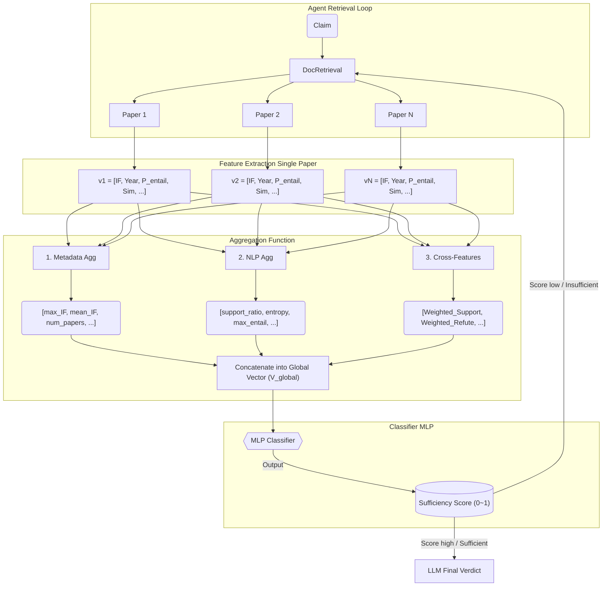

# Scientific Claim Verification: Feature Engineering & Aggregation

This document defines the technical specifications for extracting features from individual papers (Local Features) and aggregating them across multiple papers (Global Aggregation). 
The objective is to train a **Routing/Stopping Criterion Classifier**. This classifier is exposed as an **LLM Agent Tool**, used iteratively during the retrieval process. It predicts a **Sufficiency Score (0 ~ 1)** based on the current evidence pool, deciding whether the information gathered is sufficient to stop retrieval and hand over to the LLM for the final verdict.

---

## Section 1: Local Feature Extraction (Single Paper Level)

In this phase, for each retrieved Evidence Paper $P_i$ and Claim $C$, we extract a feature vector $v_i$. These features are categorized into three groups: Metadata, NLP Metrics, and LLM Reasoning.

### 1. Metadata Features (Source Reliability & Context)
These features quantify the credibility and timeliness of the evidence source, acting as a Bayesian prior for the verification model.

* **Publication Year (Done)**
* **Journal Impact Factor (IF) (Done)**
    * **Definition:** The impact metric of the venue (journal/conference). Recommended preprocessing: $\log(1 + \text{IF})$.
* **Normalized Citation Count (Done)**
    * **Definition:** The citation count of the paper, normalized by its age.
    * **Formula:** $\frac{\text{Citation Count}}{\text{Current Year} - \text{Pub Year} + 1}$.
* **Author H-index (Max) (Done)**
    * **Definition:** The highest H-index among the paper's authors.
* **Document Type (Paused)**
    * **Definition:** Categorical classification of the evidence level.
    * **Values:** `[Meta-analysis, RCT, Cohort Study, Case Report, Review, Opinion]`.
    * **Rationale:** Based on the Hierarchy of Evidence, a Meta-analysis or RCT carries significantly more weight than an Opinion piece or Case Report.
* **Section Source (Paused)**
    * **Definition:** The specific section of the paper from which the evidence sentence was extracted.
    * **Values:** `[Abstract, Introduction, Methods, Results, Discussion]`.
    * **Rationale:** Evidence from `Results` is direct experimental data, whereas `Introduction` may cite external work, and `Discussion` is interpretative.

### 2. NLP Features (Semantics & Alignment)
These features capture the linguistic alignment and logical entailment between the Claim and the Evidence text.

* **Semantic Similarity (Done)**
    * **Definition:** Cosine similarity between the embeddings (e.g., SBERT) of the Claim and the Evidence.
    * **Rationale:** Measures topical proximity and relevance in the vector space.
* **Claim Entity Coverage (Done)**
    * **Definition:** Recall of Named Entities in the Claim that also appear in the Evidence: $\frac{|\text{Claim Entities} \cap \text{Evidence Entities}|}{|\text{Claim Entities}|}$.
    * **Rationale:** Since claims are much shorter than evidence texts (e.g., full abstracts), Jaccard similarity is diluted by the many entities in the evidence. Recall focuses on whether the evidence covers the specific entities mentioned in the claim, providing a more meaningful alignment signal.
* **NLI (Natural Language Inference) Entailment Score (Done)**
    * **Definition:** Probabilities predicted by a fine-tuned Natural Language Inference model (e.g., DeBERTa-v3-large).
    * **Output:** Vector: $[P(\text{Entailment}), P(\text{Contradiction}), P(\text{Neutral})]$.
    * **Rationale:** The most direct semantic signal indicating whether the text supports or refutes the claim.

### 3. LLM-Native Features (Reasoning & Uncertainty) (Paused)
Leveraging the zero-shot reasoning capabilities and intrinsic uncertainty metrics of Large Language Models. *(Currently all active LLM features are marked as Paused to ensure the classifier remains lightweight and independent of the LLM).*

* **LLM Verdict (Paused)**
    * **Definition:** The classification label predicted by the LLM after reading the evidence (One-hot encoded).
    * **Values:** `[Supported, Refuted, Not Enough Info]`.
* **Verdict Confidence (Logprobs) (Paused)**
    * **Definition:** The exponential of the log-probability of the generated verdict token.
    * **Formula:** $\exp(\text{LogProb}(\text{"Supported"}))$.
    * **Rationale:** Represents the model's intrinsic confidence (uncertainty) in its own judgment.
* **Context Sufficiency (Paused)**
    * **Definition:** A score (Binary or 0-1) assessing whether the retrieved text contains *enough information* to verify the claim.
    * **Rationale:** Filters out paragraphs that are topically relevant but lack the specific evidentiary value needed.
* **Perplexity (PPL) (Paused)**
    * **Definition:** The perplexity of generating the Claim conditioned on the Evidence: $P(\text{Claim} | \text{Evidence})$.
    * **Rationale:** If the Evidence supports the Claim, the Claim should follow naturally (low PPL). If they contradict, PPL is typically higher.

---

## Section 2: Feature Aggregation Methods (Multi-Paper Level)

Once we have collected Local Feature Vectors $\{v_1, v_2, ..., v_n\}$ for $N$ papers, we compress them into a single global vector ($V_{global}$) for the Classifier. 

### Iterative Execution Flow
This process is **iterative**. Every time the LLM Agent retrieves a new paper $P_{N+1}$:
1. **Extraction:** $v_{N+1}$ is extracted (Local Features).
2. **Expansion:** The evidence pool is updated: $Pool_{N+1} = Pool_N \cup \{v_{N+1}\}$.
3. **Aggregation:** The *entire pool* is re-aggregated into a new $V_{global}$.
4. **Classification:** The Classifier evaluates $V_{global}$ to output a new **Sufficiency Score**.

The Classifier evaluates this vector to output a **Sufficiency Score (0 ~ 1)**.

### Pipeline Flowchart

### 1. Metadata Aggregation (Prior Credibility)
Metadata features are aggregated to represent the overall "quality", "authority", and "timeliness" of the current evidence pool.

* **Evidence Volume**
    * `num_papers`: Total number of retrieved papers ($N$). Very few papers might mean low sufficiency.
* **Authority & Quality**
    * `max_IF`: The highest Impact Factor in the pool (the "quality ceiling").
    * `mean_IF`: The average publication quality.
    * `max_h_index`: Highest author H-index in the pool.
    * `avg_max_h_index`: The average of "Max Author H-index" across retrieved papers. (Representing consistent authority).
* **Community Attention**
    * `max_norm_citation`: Highest normalized citation count (presence of a seminal/breakthrough paper).
    * `mean_norm_citation`: Average attention the evidence pool has received.
* **Temporal Footprint**
    * `latest_year_age`: How recent the newest evidence is (e.g., `Current Year - Max(Pub Year)`).
    * `year_span`: The time range covered by the evidence pool (`Max(Pub Year) - Min(Pub Year)`). A larger span indicates a long-studied topic.

### 2. NLP Feature Aggregation (Semantic Signal & Consensus)
NLP features (like NLI entailment probabilities and Semantic Similarity) are aggregated to represent the consensus, semantic relevance, and controversy of the evidence.

* **Voting & Consensus (Stance Distribution)**
    * `entailment_ratio` ($p_{ent}$): Proportion of papers where `argmax(P) == Entailment`.
    * `contradiction_ratio` ($p_{con}$): Proportion of papers where `argmax(P) == Contradiction`.
    * `controversy_index` (Entropy): Shannon entropy of the stance distribution. 
        * **Formula:** $H = - \sum_{k \in \{ent, con, neu\}} p_k \log_2 p_k$ (where $p_{neu} = 1 - p_{ent} - p_{con}$).
        * **Rationale:** High entropy indicates high disagreement or uncertainty in the pool. Low entropy indicates a clear, unified stance.
* **Statistical Pooling (Signal Strength)**
    * `max_entity_coverage`: $\max(\text{Entity Coverage})$ across all $N$ papers.
    * `mean_entity_coverage`: Average recall of claim entities across the evidence pool.
    * `max_similarity`: $\max(\text{Semantic Similarity})$ across all $N$ papers.
    * `mean_similarity`: Average semantic relevance to the claim.

### 3. Cross-Features (Signal $\times$ Quality Interaction)
**What is a Cross-Feature?** 
If we feed `max_IF = 40` and `entailment_ratio = 0.5` independently to the Classifier, it doesn't know if the `IF=40` paper voted "Entailment", "Contradiction", or "Neutral". A cross-feature explicitly multiplies a metadata weight with an NLP signal *before* aggregation.

**Sufficiency Logic & Symmetrical Signal:**
To predict **Sufficiency ($y=1$)**, the classifier must recognize both strong positive and strong negative consensus. Therefore, Cross-features must be computed for both Entailment and Contradiction. A high score in either, especially when weighted by high-quality metadata, signals that the evidence pool is sufficient to reach a definitive verdict.

#### The 4 Scenarios of Sufficiency
The interaction between `Weighted_Entailment` and `Weighted_Contradiction` typically falls into four categories:
*   **Case A (Strong Support):** Entailment is high, Contradiction is low $\rightarrow$ **Sufficient ($y=1$)**.
*   **Case B (Strong Refutation):** Entailment is low, Contradiction is high $\rightarrow$ **Sufficient ($y=1$)**.
*   **Case C (Information Deficit):** Both are low $\rightarrow$ **Insufficient ($y=0$)**.
*   **Case D (High-Profile Conflict):** Both are high $\rightarrow$ **Insufficient ($y=0$)** (Requires more papers or LLM arbitration due to lack of consensus).

* **Quality-Weighted Stance Score**
    * `Weighted_Entailment` = $\sum_{i=1}^{N} \log(1 + IF_i) \cdot P_{entailment, i}$
    * `Weighted_Contradiction` = $\sum_{i=1}^{N} \log(1 + IF_i) \cdot P_{contradiction, i}$
    * *Rationale:* Scales the stance probability of each paper by its Impact Factor. If `Weighted_Contradiction` is very high while `Weighted_Entailment` is low, the system is Sufficiently Refuted ($y=1$).
* **Attention-Weighted Stance Score**
    * `Weighted_Entailment` = $\sum_{i=1}^{N} \text{Norm\_Citation}_i \cdot P_{entailment, i}$
    * `Weighted_Contradiction` = $\sum_{i=1}^{N} \text{Norm\_Citation}_i \cdot P_{contradiction, i}$
    * *Rationale:* Heavily cited papers have a stronger influence on the aggregated stance.
* **Temporal-Decay Stance Score**
    * `Weighted_Entailment` = $\sum_{i=1}^{N} e^{-\lambda(\text{Current Year} - \text{Pub Year}_i)} \cdot P_{entailment, i}$
    * `Weighted_Contradiction` = $\sum_{i=1}^{N} e^{-\lambda(\text{Current Year} - \text{Pub Year}_i)} \cdot P_{contradiction, i}$
    * *Rationale:* Newer papers are given higher weight in determining the current scientific consensus.

---

## Section 3: Dataset Selection

### Primary Dataset: **SciFact-Open**

**Location:** `/hps/nobackup/saezrodriguez/shared_datasets/scifact-open/`

**Dataset Overview:**
* **Rationale for Selection:** SciFact-Open often maps a single claim to multiple evidence papers, which is ideal and necessary for our multi-paper verification and aggregation goal.
* **Total Claims:** 279
* **Claims WITH Evidence:** 206 (73.8%)
* **Claims WITHOUT Evidence:** 73 (26.2%)

**Evidence Distribution (for 206 claims with evidence):**
* 1 evidence document: 125 claims (60.7%)
* 2 evidence documents: 36 claims (17.5%)
* 3 evidence documents: 12 claims (5.8%)
* 4 evidence documents: 11 claims (5.3%)
* 5+ evidence documents: 22 claims (10.7%)
---

## Section 4: Classifier Training Target & Strategy

Because standard claim verification datasets provide ground-truth labels (`Supported`, `Refuted`, `Not Enough Info`), we define the **Sufficiency Target ($y$)** for the binary classifier as follows:

### Target Formulation (Sufficiency Labeling)
1. **Sufficient ($y = 1$) (Unanimous Support/Refutation):** 
   If a claim has evidence and **all** retrieved evidence papers point to the same, unanimous result (e.g., all "Supported" or all "Refuted"), we label the evidence pool as Sufficient ($y=1$).
2. **Insufficient ($y = 0$) (Conflicting Evidence):** 
   If the evidence pool contains conflicting signals (e.g., some evidence points to "Supported" and some to "Refuted"), we label the pool as Insufficient ($y=0$). This forces the Agent to seek more evidence or default to an LLM fallback.
3. **Insufficient ($y = 0$) (Data Augmentation - Irrelevant Papers):**
   To simulate poor retrieval or early stages of evidence gathering, we use data augmentation. We take a claim and randomly append irrelevant/unrelated papers to its evidence pool. These synthesized pools are labeled as Insufficient ($y=0$).

### Agent Routing & Infinite Loop Prevention
If the classifier predicts $y = 0$ (Insufficient), the Agent will continue retrieving more papers. However, to prevent an infinite loop in cases of "Conflicting Evidence" (where the academic community is genuinely split), the Agent requires a hard limit:
* **Max Retrieval Limit:** If the Agent reaches $K$ retrieval rounds or $M$ papers and the classifier still predicts $y=0$, the loop is forced to terminate.
* **LLM Fallback:** The Agent then sends the conflicting or sparse evidence pool to the LLM. The LLM, recognizing the lack of compelling unilateral proof, will correctly predict **Uncertain / Not Enough Info**, which aligns perfectly with the dataset's ground truth for such boundary cases.

### Recommended Training Strategy

#### **Goal:**
Train a binary classifier that predicts a **Sufficiency Score (0~1)** for the current evidence pool.

#### **Training Loop Strategy:**
1. **Positive Samples ($y=1$):**
   * Sample claims from SciFact-Open.
   * Collect ground-truth evidence papers for a claim that all share the same stance.
   * Extract and aggregate features to form the positive training vectors.
2. **Negative Samples - Conflict ($y=0$):**
   * Synthesize conflicting evidence pools by combining supporting papers and refuting papers for the same claim (if available or through hard negative mining).
   * Extract and aggregate features to form training vectors labeled $y=0$.
3. **Negative Samples - Noise Augmentation ($y=0$):**
   * Sample a claim.
   * Retrieve randomly sampled, unrelated papers from the corpus.
   * Extract and aggregate features. Label these as $y=0$ to teach the classifier to recognize irrelevant evidence pools.

---

## Section 5: Mathematical Formulation

Given a claim $C$ and a retrieved evidence pool $\mathcal{P} = \{P_1, \ldots, P_N\}$, we first extract per-paper feature vectors $\mathbf{v}_i = \phi(C, P_i) = [\mathbf{v}_i^{\text{meta}}, \mathbf{v}_i^{\text{nlp}}] \in \mathbb{R}^k$, comprising metadata features (log-transformed impact factor, normalized citations, h-index, publication year) and NLP features (max-pooled semantic similarity, entity coverage recall, NLI entailment/contradiction/neutral probabilities). These local vectors are then compressed into a single global representation $\mathbf{v}_{\text{global}} = g(\mathbf{v}_1, \ldots, \mathbf{v}_N) = [\mathbf{a}^{\text{meta}}, \mathbf{a}^{\text{nlp}}, \mathbf{a}^{\text{cross}}] \in \mathbb{R}^d$ via deterministic aggregation: metadata pooling (max, mean over quality/authority indicators), NLP consensus statistics (stance ratios, Shannon entropy as controversy index, pooled similarity), and cross-features $a_k^w = \sum_i w_i \cdot p_i^k$ that weight each paper's NLI stance by its quality score (IF, citation count, or temporal decay). A binary classifier $f_\theta: \mathbb{R}^d \to [0,1]$, implemented as a 2-layer MLP with batch normalization and dropout, is trained with class-weighted binary cross-entropy to predict a sufficiency score $\hat{y} = \sigma(f_\theta(\mathbf{v}_{\text{global}}))$.

---

## Section 6: Implementation Notes

> **Status:** All scripts below are implemented, tested, and producing results as of 2026-02-26.

### Scripts Inventory (`scripts/claude_sdk/`)

| Script | Purpose |
|--------|---------|
| `generate_classifier_data.py` | End-to-end pipeline: loads SciFact-Open claims + corpus, builds evidence pools (positive/negative-conflict/negative-noise), extracts per-paper features, aggregates, and outputs `data/classifier_train_data.json` |
| `train_mlp_classifier.py` | Trains the 2-layer MLP classifier with configurable feature presets (`all`, `important`, `minimal`). Saves weights + config to `results/models/classifier*/` |
| `test_mlp_classifier.py` | Inference script: loads a trained model and predicts on a given `claim_id`, showing logits, probabilities, and per-pool-type results |
| `analyze_classifier_features.py` | Feature analysis: Cohen's d (separability), Pearson correlation matrix (multicollinearity), PCA variance explained + biplot. Outputs plots to `results/models/classifier/analysis/` |
| `model_selection.py` | Compares Logistic Regression, small MLP (1-layer, 16 units), and large MLP (2-layer, 64→32) across all feature presets using the same train/val/test split |
| `extract_features_scifact.py` | Shared NLP feature extraction utilities (Semantic Similarity, NLI, BiomedicalEntityExtractor) used by `generate_classifier_data.py` |
| `fetch_full_texts.py` | Downloads full-text PDFs/XMLs for SciFact-Open corpus documents |
| `resolve_pmids.py` | Resolves SciFact-Open `doc_id` → PubMed PMID mapping (cached in `data/doc_id_to_pmid_cache.json`) |
| `regenerate_noise.py` | Utility to regenerate only the noise augmentation samples without re-running the full pipeline |

### Key Infrastructure

- **Metadata caching**: `PaperFeatureExtractor` (in `src/pkevolve/verification/feature_extractor.py`) caches PubMed/OpenAlex API responses to `data/metadata_cache.json`, avoiding redundant network calls on re-runs.
- **Entity extraction**: Uses `scispacy` MCP server for biomedical named entity recognition with retry logic.
- **NLI model**: `cross-encoder/nli-deberta-v3-large` via HuggingFace, applied chunk-by-chunk with max-pool/best-chunk strategies.

---

## Section 7: Dataset Generation Results

### Final Dataset: `data/classifier_train_data.json`

| Metric | Value |
|--------|-------|
| **Total samples** | 727 |
| **Unique claims** | 279 |
| **Target y=1 (Sufficient)** | 378 (52.0%) |
| **Target y=0 (Insufficient)** | 349 (48.0%) |

### Pool Type Breakdown

| Pool Type | Count | Target | Description |
|-----------|-------|--------|-------------|
| `positive_support` | 194 | y=1 | All evidence unanimously SUPPORT |
| `positive_contradict` | 184 | y=1 | All evidence unanimously CONTRADICT |
| `negative_conflict` | 158 | y=0 | Mixed SUPPORT + CONTRADICT evidence (expanded via claim combinations for claims with >2 papers) |
| `negative_noise` | 191 | y=0 | Ground-truth evidence + randomly injected irrelevant papers (varying count: 1–3 extra papers) |

### Data Augmentation Strategy

- **Negative-conflict expansion**: For claims with `num_papers > 2` and both SUPPORT + CONTRADICT labels present, we generate combinations of evidence subsets that preserve the conflict (each subset retains at least one SUPPORT and one CONTRADICT paper). Capped at `max_combos_per_claim = 41`.
- **Noise injection**: For each claim, we inject 1–3 random unrelated papers from the corpus into the ground-truth evidence pool, simulating poor retrieval.
- The target was to balance `negative_conflict` ≈ `negative_noise` counts; the final ratio is 158:191, which is reasonably balanced.

---

## Section 8: Feature Analysis & Model Selection Results

### 8.1 Feature Analysis (Cohen's d)

Features ranked by Cohen's d (effect size for separability between y=0 and y=1):

| Feature | Cohen's d | Notes |
|---------|-----------|-------|
| `mean_similarity` | 1.27 | **Strongest separator** |
| `max_similarity` | 1.17 | Highly correlated with mean_similarity (r>0.9) |
| `num_full_text` | 0.84 | |
| `num_papers_with_metadata` | 0.82 | Highly correlated with num_full_text (r>0.9) |
| `year_span` | 0.72 | |
| `mean_entity_coverage` | 0.70 | |
| `max_entity_coverage` | 0.68 | Highly correlated with mean (r>0.9) |
| `controversy_index` | 0.43 | |
| `weighted_entailment_temporal` | 0.36 | |
| `mean_norm_citation` | 0.36 | |

### 8.2 Feature Presets (After Multicollinearity Pruning)

Based on the analysis above, three feature presets were defined by removing one feature from each highly correlated pair (r>0.9):

- **`all`** (24 features): All features, including correlated pairs
- **`important`** (10 features): Top features by Cohen's d, pruned for multicollinearity: `mean_similarity`, `num_full_text`, `year_span`, `mean_entity_coverage`, `controversy_index`, `weighted_entailment_temporal`, `mean_norm_citation`, `mean_log_IF`, `contradiction_ratio`, `num_papers`
- **`minimal`** (5 features): Top-5 only: `mean_similarity`, `num_full_text`, `year_span`, `mean_entity_coverage`, `controversy_index`

### 8.3 Model Selection Results

Three model architectures were compared across all feature presets using the same 70/15/15 train/val/test split (random_state=42, stratified):

| Model | Architecture | Features | #Feat | Acc | Prec | Rec | F1 |
|-------|-------------|----------|-------|-----|------|-----|-----|
| Logistic Regression | Linear | all | 24 | 0.864 | 0.875 | 0.860 | 0.867 |
| Small MLP | 1-layer (16 units) | all | 24 | 0.909 | 0.898 | 0.930 | **0.914** |
| Large MLP | 2-layer (64→32) | all | 24 | 0.891 | 0.909 | 0.877 | 0.893 |
| Logistic Regression | Linear | important | 10 | 0.718 | 0.741 | 0.702 | 0.721 |
| Small MLP | 1-layer (16 units) | important | 10 | 0.882 | 0.907 | 0.860 | 0.883 |
| **Large MLP** | **2-layer (64→32)** | **important** | **10** | **0.918** | **0.929** | **0.912** | **0.920** ⭐ |
| Logistic Regression | Linear | minimal | 5 | 0.736 | 0.741 | 0.754 | 0.748 |
| Small MLP | 1-layer (16 units) | minimal | 5 | 0.827 | 0.828 | 0.842 | 0.835 |
| Large MLP | 2-layer (64→32) | minimal | 5 | 0.846 | 0.833 | 0.877 | 0.855 |

### 8.4 Key Findings

1. **Best model**: Large MLP (2-layer, 64→32) with `important` features (10 features) — **F1 = 0.920**
2. **Non-linearity matters**: Logistic Regression consistently underperforms MLPs (best LR F1=0.867 vs best MLP F1=0.920), confirming the feature interactions (especially cross-features) require non-linear modelling.
3. **Feature selection helps**: The `important` preset (10 features) outperforms `all` (24 features) for the large MLP (0.920 vs 0.893), suggesting multicollinear features add noise.
4. **Small MLP is competitive**: With all 24 features, the small single-layer MLP (F1=0.914) nearly matches the best result, indicating a simpler model can work if given enough features.
5. **Minimal features are insufficient**: Dropping to 5 features degrades all models significantly (best F1=0.855).

### 8.5 Selected Model for Deployment

- **Architecture**: 2-layer MLP (input→64→BatchNorm→ReLU→Dropout→32→BatchNorm→ReLU→Dropout→1)
- **Feature preset**: `important` (10 features)
- **Saved to**: `results/models/classifier_best/`
- **Config**: `results/models/classifier_best/mlp_config.json`
- **Full results**: `results/models/classifier_best/model_selection_results.json`

## Appendix: CivicFact Dataset Information

*(Retained for reference as it contains useful information, though SciFact-Open is the primary target)*

**Location:** `/hps/nobackup/saezrodriguez/shared_datasets/civicfact`

**Dataset Overview:**
* **Total Samples:** 23,239 claim-evidence pairs
* **Structure:** Each claim maps to exactly **one paper** (single-document verification)
* **Multi-evidence:** 14.2% of claims have multiple evidence pieces from the same paper

**Label Distribution:**
* **NEI (Not Enough Info):** 12,025 samples (51.7%)
* **SUPPORTS:** 5,911 samples (25.4%)
* **REFUTES:** 5,303 samples (22.8%)

**Data Split:**
* **Train:** 6,428 samples (27.7%)
* **Dev:** 2,099 samples (9.0%)
* **Test:** 2,055 samples (8.8%)
* **Unassigned:** 12,657 samples (54.5%) — Can be used for additional training
---